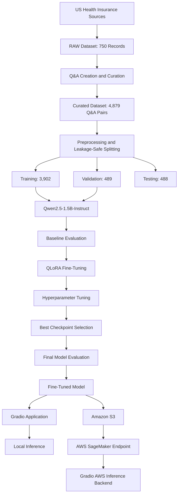

```mermaid
flowchart TD
    A["US Health Insurance Sources"] --> B["RAW Dataset: 750 Records"]
    B --> C["Q&A Creation and Curation"]
    C --> D["Curated Dataset: 4,879 Q&A Pairs"]
    D --> E["Preprocessing and Leakage-Safe Splitting"]
    E --> F["Training: 3,902"]
    E --> G["Validation: 489"]
    E --> H["Testing: 488"]
    F --> I["Qwen2.5-1.5B-Instruct"]
    G --> I
    I --> J["Baseline Evaluation"]
    J --> K["QLoRA Fine-Tuning"]
    K --> L["Hyperparameter Tuning"]
    L --> M["Best Checkpoint Selection"]
    M --> N["Final Model Evaluation"]
    N --> O["Fine-Tuned Model"]
    O --> P["Gradio Application"]
    P --> Q["Local Inference"]
    O --> R["Amazon S3"]
    R --> S["AWS SageMaker Endpoint"]
    S --> T["Gradio AWS Inference Backend"]
```