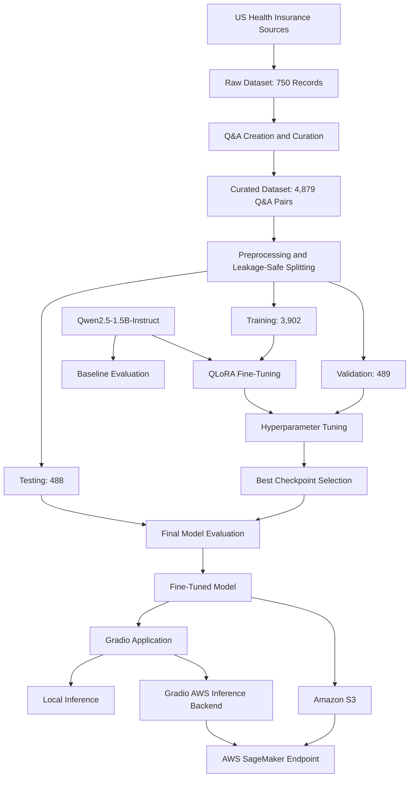

```mermaid
flowchart TD
    A[US Health Insurance Sources] --> B[Raw Dataset: 750 Records]
    B --> C[Q&A Creation and Curation]
    C --> D[Curated Dataset: 4,879 Q&A Pairs]
    D --> E[Preprocessing and Leakage-Safe Splitting]

    E --> F[Training: 3,902]
    E --> G[Validation: 489]
    E --> H[Testing: 488]

    I[Qwen2.5-1.5B-Instruct] --> J[Baseline Evaluation]
    F --> K[QLoRA Fine-Tuning]
    I --> K
    G --> L[Hyperparameter Tuning]
    K --> L
    L --> M[Best Checkpoint Selection]
    M --> N[Final Model Evaluation]
    H --> N
    N --> O[Fine-Tuned Model]

    O --> P[Gradio Application]
    P --> Q[Local Inference]
    P --> R[Gradio AWS Inference Backend]
    S --> T[AWS SageMaker Endpoint]
    R --> T
    O --> S[Amazon S3]
```
